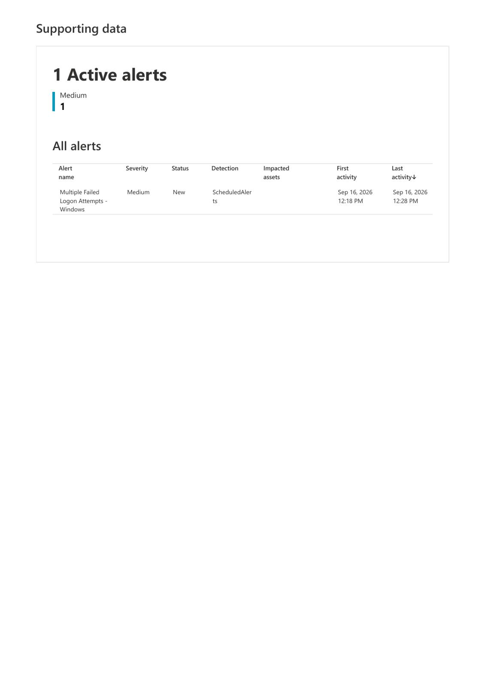
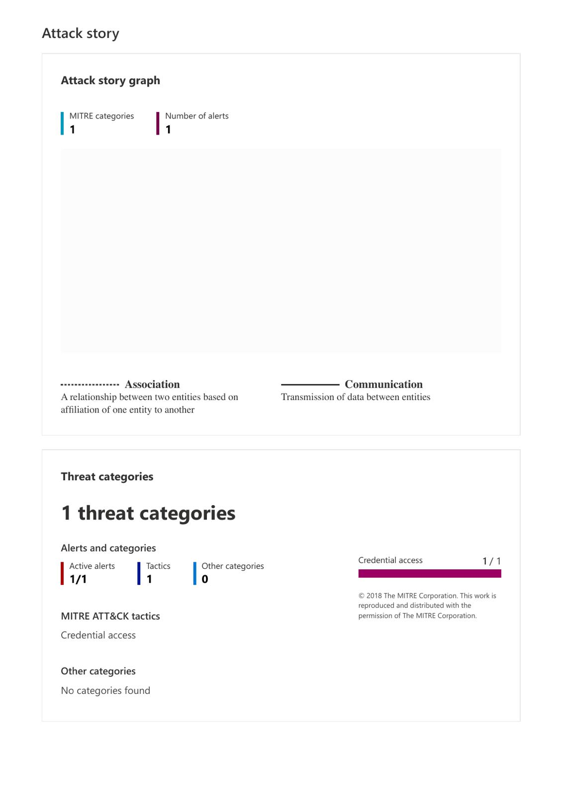
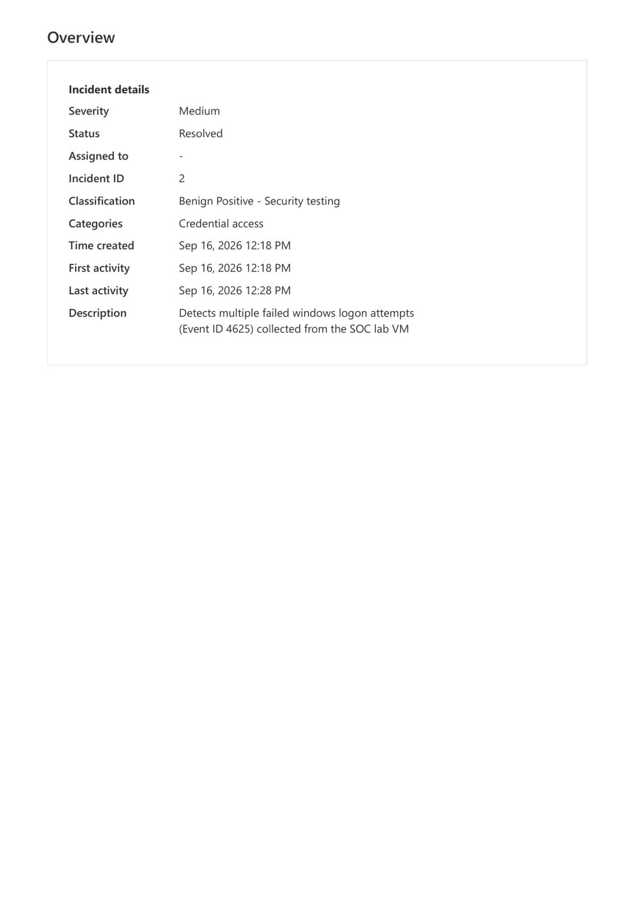

# 🛡️ Microsoft Sentinel SOC Lab

## Overview

This project demonstrates a hands-on Security Operations Center (SOC) environment built with Microsoft Sentinel.

The lab was designed to collect Windows security logs, detect suspicious authentication activity, generate security alerts, investigate an incident, and complete the incident response workflow.

The project simulates a real-world SOC analyst investigation involving multiple failed Windows logon attempts.

## 🎯 Objectives

•⁠  ⁠Configure Microsoft Sentinel as a SIEM
•⁠  ⁠Collect Windows Security Events from a lab virtual machine
•⁠  ⁠Analyze authentication logs using KQL
•⁠  ⁠Detect multiple failed Windows logon attempts
•⁠  ⁠Generate and investigate a Microsoft Sentinel incident
•⁠  ⁠Map the activity to the MITRE ATT&CK framework
•⁠  ⁠Perform incident triage and classification
•⁠  ⁠Complete the incident response lifecycle

## 🛠️ Technologies Used

•⁠  ⁠Microsoft Azure
•⁠  ⁠Microsoft Sentinel
•⁠  ⁠Log Analytics Workspace
•⁠  ⁠Windows Virtual Machine
•⁠  ⁠Windows Security Event Logs
•⁠  ⁠Kusto Query Language (KQL)
•⁠  ⁠Microsoft Defender
•⁠  ⁠MITRE ATT&CK

## 🔍 Detection Scenario

The detection scenario focused on repeated failed Windows authentication attempts.

Windows records failed logon attempts using:

*Event ID 4625 — An account failed to log on*

Security events generated by the SOC lab virtual machine were collected and analyzed in Microsoft Sentinel.

The detection generated the following incident:

*Multiple Failed Logon Attempts - Windows*

Severity: *Medium*

MITRE ATT&CK Tactic: *Credential Access*

## 🔎 Incident Investigation

The investigation workflow included:

 1.⁠ ⁠Generating failed authentication attempts in the Windows lab environment
 2.⁠ ⁠Collecting Windows Security Event logs
 3.⁠ ⁠Querying security data
 4.⁠ ⁠Triggering a Sentinel analytics rule
 5.⁠ ⁠Generating a security alert
 6.⁠ ⁠Opening and investigating the Sentinel incident
 7.⁠ ⁠Reviewing the incident timeline and associated alert
 8.⁠ ⁠Mapping the activity to MITRE ATT&CK
 9.⁠ ⁠Classifying the activity as security testing
10.⁠ ⁠Resolving the incident

## 🧠 Incident Classification

After investigation, the incident was classified as:

*Benign Positive — Security Testing*

The activity was intentionally generated as part of the SOC lab and did not represent an actual compromise.

## 📊 Skills Demonstrated

•⁠  ⁠SIEM Monitoring
•⁠  ⁠Microsoft Sentinel
•⁠  ⁠Security Event Analysis
•⁠  ⁠KQL
•⁠  ⁠Windows Event Log Analysis
•⁠  ⁠Alert Investigation
•⁠  ⁠Incident Triage
•⁠  ⁠Incident Response
•⁠  ⁠MITRE ATT&CK
•⁠  ⁠Credential Access Detection
•⁠  ⁠SOC Analyst Workflow

## 📁 Evidence

### Incident Overview

The incident was generated after multiple failed Windows authentication attempts were detected by Microsoft Sentinel.

The incident was classified as *Medium severity, mapped to **Credential Access, and resolved as **Benign Positive — Security Testing*.

### MITRE ATT&CK Mapping

Microsoft Sentinel mapped the detected activity to the *Credential Access* tactic in the MITRE ATT&CK framework.

### Alert Supporting Data

The analytics rule generated the *Multiple Failed Logon Attempts - Windows* alert from the Windows security events collected during the lab.

### Detection Query

The KQL detection logic used in this project is available here:

[⁠ failed-logon-detection.kql ⁠](detections/failed-logon-detection.kql)

### Full Incident Report

The complete Microsoft Sentinel incident report exported after the investigation is available here:

[⁠ Incident 2.pdf ⁠](Incident%202.pdf)

## 🚀 Future Improvements

Future iterations of this lab will include:

•⁠  ⁠Additional detection rules
•⁠  ⁠PowerShell activity monitoring
•⁠  ⁠Account creation and privilege escalation detection
•⁠  ⁠Advanced KQL queries
•⁠  ⁠Automated incident response
•⁠  ⁠Additional MITRE ATT&CK techniques

---

*Project Type:* Hands-on SOC / Blue Team Lab  
*Platform:* Microsoft Sentinel  
*Author:* José Roberto Vasconcelos
